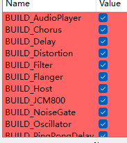

# LabAudioEffect
A series of audio effect plugins created personally using JUCE,just for fun

## Build
```sh
install CMake(version >= 3.22)
install C++ Compiler(GCC,Clang,MSVC etc)

git submoddule update --init --recursive
mkdir build
cd build
cmake ..
cmake --build .

#then executable and vst3 plugin all listed in (build/Bin/) folder 
```

Build only one or several plugins can set options on CMake GUI,like:



or set command like _DBUILD_XXX=ON/OFF to enable/disable plugin build,like:

```sh
cmake -DBUILD_Chorus=ON -DBUILD_JCM800=OFF ..
```

## Create(or Delete) a plugin

I use a python script to manage plugin creation or deletion,this script manage plugin folder, regist to main CMake script automatically

```sh
install python3

python3 plugin_helper [option(-c(or --create),-d(or --delete))] [plugin_name] #such as:python3 plugin_helper -c Delay
```

## References
[JUCE-Official-Tutorials](https://juce.com/learn/tutorials/)

[Audio-Effects](https://github.com/juandagilc/Audio-Effects)

[Audio-Plugin-Development-Resources](https://github.com/jareddrayton/Audio-Plugin-Development-Resources)

[awesome-juce](https://github.com/sudara/awesome-juce)